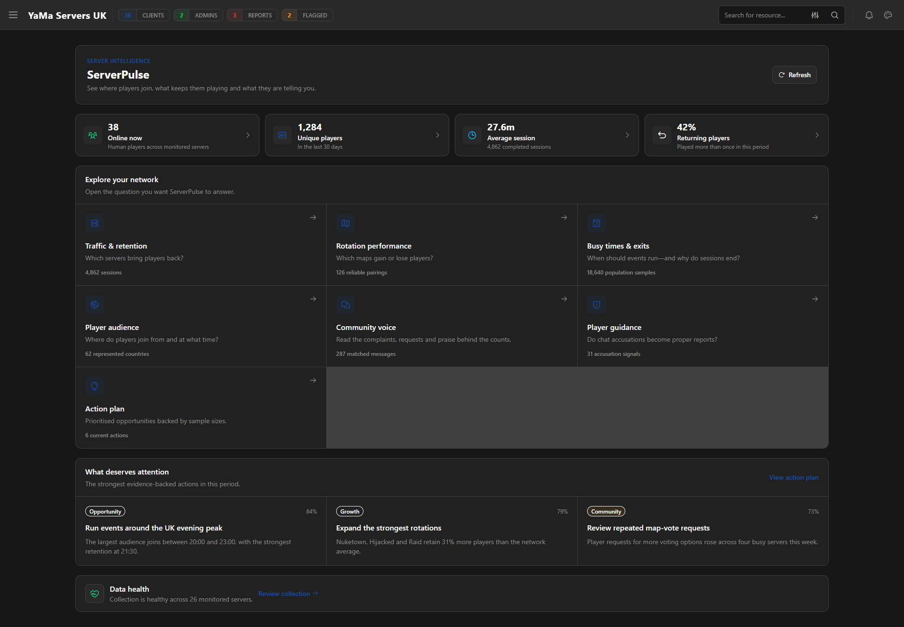
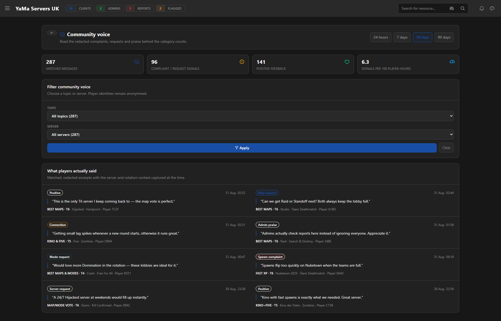
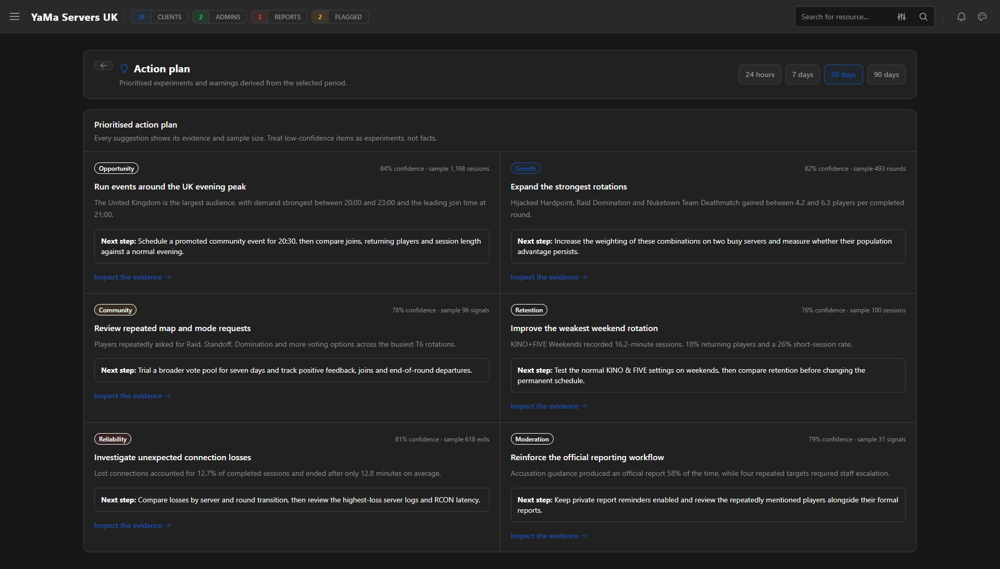

# ServerPulse    

**Privacy-conscious server analytics, community insight and player guidance for IW4MAdmin.**

ServerPulse turns normal [IW4MAdmin](https://github.com/RaidMax/IW4M-Admin) events into a native operations workspace. See where players join, what keeps them playing, which rotations lose them, what the community is saying and whether chat accusations become useful reports.

Dashboard shown with representative sample data. ServerPulse never changes server settings automatically.

## What ServerPulse answers

- **Traffic and retention:** which servers attract players and bring them back?
- **Rotation performance:** which map and mode combinations gain or lose population?
- **Busy times and exits:** when should events run, and why do sessions end?
- **Player audience:** which privacy-safe regions and join times lead demand?
- **Community Voice:** what are players actually complaining about, requesting or praising?
- **Player Guidance:** do accusations become proper reports, and who is repeatedly mentioned?
- **Action plan:** which evidence-backed changes deserve a measured experiment?
- **Data health:** is collection, storage and live telemetry operating correctly?

## Read the community behind the counts

Matching chat can be retained as short redacted excerpts with anonymous player, server, map and mode context. Raw chat is not stored by default.

## Turn evidence into action

Recommendations show their evidence, confidence and sample size. They are prompts for controlled tests—not automatic configuration changes or punishment decisions.

## Install

1. Download `ServerPulse.dll` from the [latest release](https://github.com/OllyMc27/ServerPulse/releases/latest).
2. Copy it into `IW4MAdmin/Plugins`.
3. Start IW4MAdmin to generate `Configuration/ServerPulse.json`.
4. Review the settings, restart IW4MAdmin, then open **Admin → ServerPulse**.

If enabling Player Guidance, remove `ChatCheatMonitor.dll` first to prevent duplicate reminders.

## Privacy by default

IP addresses are never written to ServerPulse analytics. General player identities are pseudonymised, small country samples are hidden, raw chat is disabled by default, and retained excerpts are redacted. Player Guidance is opt-in and never punishes players automatically.

## Documentation

The [ServerPulse wiki](https://github.com/OllyMc27/ServerPulse/wiki) contains installation, configuration, dashboard, privacy, Player Guidance and troubleshooting guides. A complete configuration example is available at [`examples/ServerPulse.json`](examples/ServerPulse.json).

## Companion plugin

Need match demos and a staff case-review workflow as well? [DemosToDiscord](https://github.com/OllyMc27/DemosToDiscord) captures IW4MAdmin evidence, delivers demos to Discord and provides a native case-review workspace. With both current plugins loaded, an administrator can resolve an otherwise ambiguous Player Guidance signal and create a proactive human-review case directly from ServerPulse.

ServerPulse v1.1.0 targets .NET 10 and the current IW4MAdmin plugin lifecycle. Licensed under the [MIT License](LICENSE).
